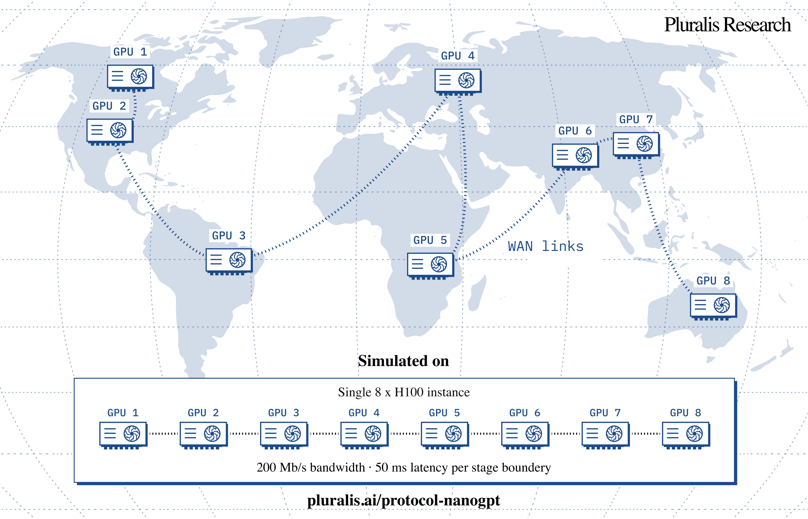

# Protocol NanoGPT

Speedrunning Pipeline Parallel Training over Low-Bandwidth Links



## Communication is the bottleneck to open-source AI.

The properties that define open-source: the ability for anyone to participate, innovate, and build on others' work, do not exist at the foundation model layer. Pluralis Research is developing Protocol Learning to change that through low-bandwidth, heterogeneous multi-party, model parallel training and inference. It means someone with nothing but a credible idea can attract enough compute to train at frontier scale, create a useful model, and, alongside training contributors, make money by doing so.

Why hasn’t it been implemented yet? **When devices communicate only via internet connections, training is bottlenecked by communication and slows to a crawl. The core thesis of Pluralis is that this is solvable.** [ [Read more about Protocol Learning →](https://pluralis.ai/blog/a-third-path-protocol-learning/) ]

Protocol NanoGPT is our speedrun competition for one aspect of this problem. Join us in creating a future where frontier models are owned by the community that builds them, and that no single party controls.

## Protocol NanoGPT Speedrun Challenge

Protocol NanoGPT is a speedrun competition for pipeline parallel LLM training over WAN links adapted from Keller Jordan’s [modded-nanogpt](https://github.com/KellerJordan/modded-nanogpt). Winners will be announced at the [CODEC-FM workshop](https://collaborative-open-decentralized-fomo.github.io/) at NeurIPS 2026 in Sydney with $18,000 USD in prizes.

This competition isolates a single aspect of Protocol Learning: speeding up pipeline parallel training over WAN links. Train a 203M-parameter model to reach a validation loss of 3.276 on FineWeb in the shortest wall-clock time. This means improving convergence speed and/or per step time. There’s a lot of freedom in how you optimize this. You can change the model architecture, optimizer, pipeline schedule, communication strategy (e.g. compression), and almost anything else outside the simulated WAN setup. The data, batch size, parameter budget, and network conditions stay fixed.

**Setup**: Runs on a single 8xH100 machine with one pipeline stage per GPU. Each link between stages is simulated as a 200 Mb/s connection with 50 ms latency (roughly home internet speed), and the score T is the total time the run would take over those links.

**Timeline**: September 24, 2026 – December 1, 2026.

The code of each entry stays private during this period. Winners will be announced at the [CODEC-FM workshop](https://collaborative-open-decentralized-fomo.github.io/) at NeurIPS 2026 in Sydney.

After the workshop, all submissions will be made public under MIT license and the repository will stay open. Anyone can keep submitting improvements and building on the results.

**Prize (USD)**: 1st place: $10,000, 2nd place: $5,000, 3rd place: $3,000

**Who can participate**: Open to individuals and teams worldwide. Academic and industry participants welcome. No NeurIPS 2026 registration required to submit.

**How to participate**: Read the [quickstart](#quickstart) and follow the instructions to [submit](#register-and-submit) your solution. For questions and discussion, join the [Zulip channel](https://community.pluralis.ai/join/5berbf624pvty3czgyzq3n4i/).

## Quickstart

Quickstart guidelines below: 1) [Repo](#repo) 2) [Score](#score) 3) [Rules](#rules).

Ready to Register? Go to the [Registration form](https://pluralis.ai/protocol-nanogpt/register.html).

Questions? Join the [Zulip channel](https://community.pluralis.ai/join/5berbf624pvty3czgyzq3n4i/).

### Repo

Use the [PluralisResearch/ProtocolNanoGPT](https://github.com/PluralisResearch/ProtocolNanoGPT) repo to get started. The baseline is an 8-layer GPT with width 1024 (203,828,352 parameters), one layer per GPU, adapted from [modded-nanogpt](https://github.com/KellerJordan/modded-nanogpt). We also provide an unoptimised reference implementation of [ReparamSSN](https://github.com/PluralisResearch/ProtocolNanoGPT/blob/main/train_gpt_ssn.py) which is based on our earlier [Subspace Networks paper](https://arxiv.org/abs/2506.01260).

```sh
git clone https://github.com/PluralisResearch/ProtocolNanoGPT.git
cd ProtocolNanoGPT
uv sync
uv run python data/cached_fineweb10B.py
WAN_MODE=off uv run torchrun --standalone --nproc_per_node=8 train_gpt.py   # loss run
WAN_MODE=on  uv run torchrun --standalone --nproc_per_node=8 train_gpt.py   # timing run
```

#### Alternative: Running with Docker (a pinned environment for reproducible verification)

```sh
git clone https://github.com/PluralisResearch/ProtocolNanoGPT.git && cd ProtocolNanoGPT
sudo docker build -t protocol-nanogpt .
sudo docker run -it --rm --gpus all --ipc=host -v $(pwd):/ProtocolNanoGPT protocol-nanogpt python data/cached_fineweb10B.py
sudo docker run -it --rm --gpus all --ipc=host -v $(pwd):/ProtocolNanoGPT -e WAN_MODE=off protocol-nanogpt torchrun --standalone --nproc_per_node=8 train_gpt.py   # loss run
sudo docker run -it --rm --gpus all --ipc=host -v $(pwd):/ProtocolNanoGPT -e WAN_MODE=on  protocol-nanogpt torchrun --standalone --nproc_per_node=8 train_gpt.py   # timing run
```

### Score

`T = total train steps × steady-state step time`

T is the wall-clock time the full run would take if every stage boundary were 200 Mb/s links with 50ms latency. T is measured in two parts. The loss run turns the slow links off so training finishes quickly, and gives the number of steps needed to reach the target loss. The timing run turns the links on and measures the steady-state step time over the simulated WAN connection. The product of the two is T.

| Run | WAN_MODE | Purpose |
|---|---|---|
| Loss run | off | Train to completion to find the number of steps it takes to reach the target loss. |
| Timing run | on | Run long enough to measure the steady-state time per step. |

**Steady-state calculation**. During the timing run, the step time in each 10-step window is recorded. If the variation is within 1% for three consecutive windows, then the run is considered to have reached a steady-state and the median step time of the three windows is used as the steady-state step time. At this point the timing run is stopped and T is calculated. This assumes that the step time is approximately the same throughout training. If your approach has multiple training phases where the step time varies between them, submit the full log of a complete run with WAN_MODE=on showing the actual wall-clock time.

**Why this approach.** Pipeline schedules can overlap communication and computation, so step time cannot be estimated from message sizes alone. We simulate network timing explicitly to capture this overlap, but use a separate timing run that only needs to reach steady-state since the full simulation can be slow and expensive.

## Rules

### Submissions

1. Fixed data, batch size, and parameter budget. The dataset and batch size are fixed. The model must not have more parameters than the baseline (203,828,352).
2. Frozen code must not be edited. This applies to any code tagged frozen, including the SimPipelineStage class, the data transfer over the simulated link (including payload accounting), and the data loading code. All other code is editable.
3. Target loss with statistical significance. We follow the [statistical significance test](https://github.com/KellerJordan/modded-nanogpt/tree/master/records/track_3_optimization#rules) from original modded-nanogpt. This means, for a single run it should pass the validation loss of 3.276 and in the case of close contenders we will conduct multiple runs to determine the ranking.
4. Reproducibility. All code needed to reproduce the run should be in one Python file. Third-party optimizer libraries may not be imported. Copy any code you need into the training script in full, even if this adds thousands of lines.
5. Validation loss frequency: Validation loss computation interval cannot be smaller than 25-steps and the earliest step that passed rule 3 is picked.

## Participation

- Open to individuals and teams worldwide.
- Academic and industry participants welcome. Pluralis Research employees may not submit solutions.
- No NeurIPS 2026 registration required to submit.
- Multiple submissions are allowed but maximum one submission per day.

## Register and Submit

### 1. Register:

Register via the form below. For team participation, list all team members in the “Contributors” field. Once registered, you will receive an email containing a secret token, which is used for submission in Step 2.

[Registration Form](https://pluralis.ai/protocol-nanogpt/register.html)

### 2. Submit Entry

An entry requires two files:

- Your [train_gpt.py](https://github.com/PluralisResearch/ProtocolNanoGPT/blob/main/records/20260917_vanilla_baseline/train_gpt.py).
- One [log.txt](https://github.com/PluralisResearch/ProtocolNanoGPT/blob/main/records/20260917_vanilla_baseline/log.txt) containing both the loss run (WAN_MODE=off, full run) and the timing run (WAN_MODE=on, short run till steady state), each containing the full source code printed.

File names do not matter.

Use the command below to submit. The participant entries will be added to the leaderboard after review.

```sh
ENDPOINT='https://script.google.com/macros/s/AKfycbxe8rs9Uze7R42iwdPXujXTyOeFaaiesHZDGngtL2kpLXkTOsxJT0NKZ-VnfrOppGrS/exec'
TOKEN='...'   # from step 1

# The description will be shown on the leaderboard. Your code stays private.
jq -n --arg tok "$TOKEN" \
      --arg d 'Description of your method in one line' \
      --rawfile t train_gpt.py --rawfile l log.txt \
      '{action:"submit", token:$tok, description:$d, train_gpt:$t, log:$l}' > entry.json

curl -sL "$ENDPOINT" -H 'Content-Type: application/json' --data-binary @entry.json
# → {"ok":true,"id":"2026-09-03-071500-team-velocity","author":"Team Velocity"}
```

## Citation, Acknowledgment, & Terms

Code written by [Yusuke Miyashita](https://x.com/miyashita_03).

```bibtex
@misc{pluralis2026protocolnanogpt,
  author = {{Pluralis Research}},
  title  = {{Protocol NanoGPT: Speedrunning Pipeline Parallel Training over Low-Bandwidth Links}},
  year   = {2026},
  url    = {https://github.com/PluralisResearch/ProtocolNanoGPT}
}
```

This speedrun is inspired by and built on [modded-nanogpt](https://github.com/KellerJordan/modded-nanogpt) by Keller Jordan and contributors.

Contact: [protocol@pluralis.ai](mailto:protocol@pluralis.ai)

[Terms of Participation](https://pluralis.ai/protocol-nanogpt/#citation)
